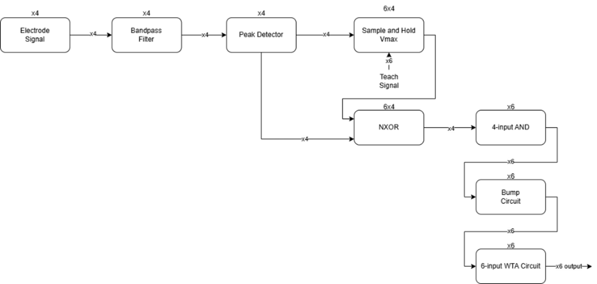

# Neural Spike Detection and Sorting Circuit Design

Author: Yihui Wang  
Course: ENEE611 – VLSI Design  
Institution: University of Maryland, College Park  
Date: Fall 2024

## Project Summary
This repository contains the design and implementation of a custom analog MOSFET-based neural spike detection and sorting system utilizing multi-electrode neural recordings. The system performs noise filtering, spike extraction, analog storage of spike signatures, and current-mode classification using Winner-Take-All (WTA) neuromorphic circuits. This work supports research toward low-power hardware for neural prosthetic applications.

This project is implemented using open-source Xschem, Ngspice, and the SkyWater 130 nm PDK.

## Objectives
- Detect bipolar neural spikes from a 4-electrode tetrode array.
- Identify 6 neurons based on amplitude-driven spike correlation.
- Train using digital teacher signals; classify in real-time during test phase.
- Meet ENEE611 fabrication-style constraints on device dimensions, area, and power.
- Output 6 labeled digital detector lines with one-hot spike identification.

## System Architecture


All blocks are based on transistor-level analog CMOS circuitry compatible with the SkyWater 130 nm process.

## Circuit Modules
| Module | Function |
|--------|----------|
| Active Bandpass Filter | Suppression of noise and enhancement of spike features |
| Peak Detector (Schmitt Trigger) | Hysteresis for robust spike event extraction |
| Transmission Gate | Low-distortion analog signal sampling |
| Vmax Sample-and-Hold | Stores peak electrode values during training |
| NXOR + AND Logic | Digital fingerprint validation across 4 electrodes |
| Bump Circuit | Current correlation based on matching results |
| WTA Circuit | Final neuron classification |

## Implementation Metrics
| Category | Result |
|---------|--------|
| Transistor area | 1118.2 μm² |
| Total large capacitors | 24 × 1 pF |
| Maximum power consumption | Approximately 23 mW |
| Output format | 6 digital lines (logic-high indicates firing) |

## Repository Structure
```plaintext
.
├─ schematics/           # Xschem schematics for modules and top-level design
├─ docs/
│   ├─ report.pdf        # Full technical documentation
│   ├─ project_guidelines.pdf
│   └─ structure.png     # System architecture diagram
└─ README.md
